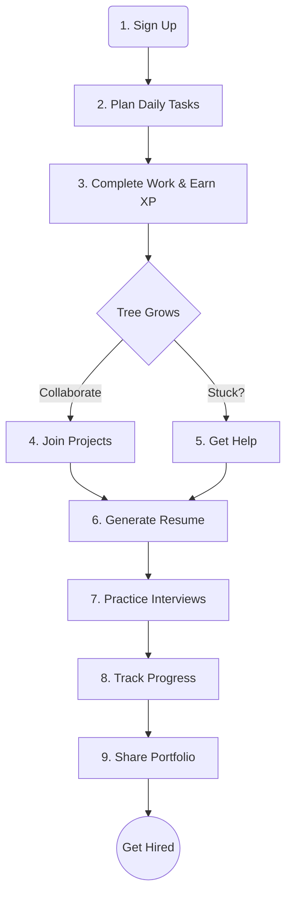
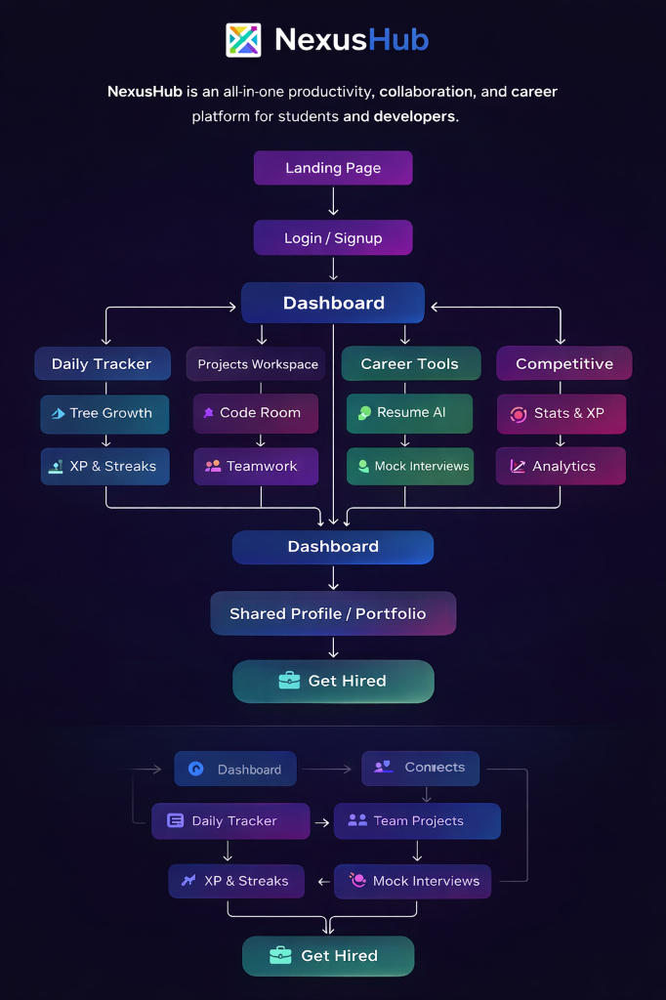
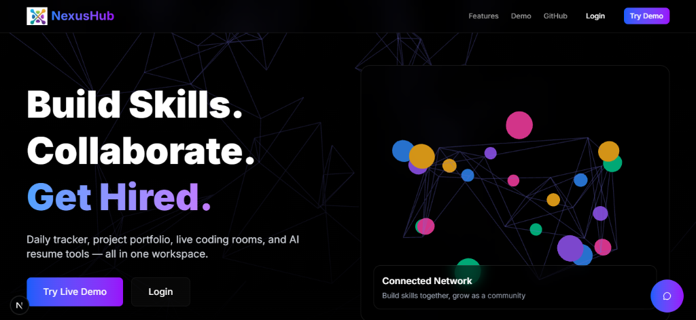
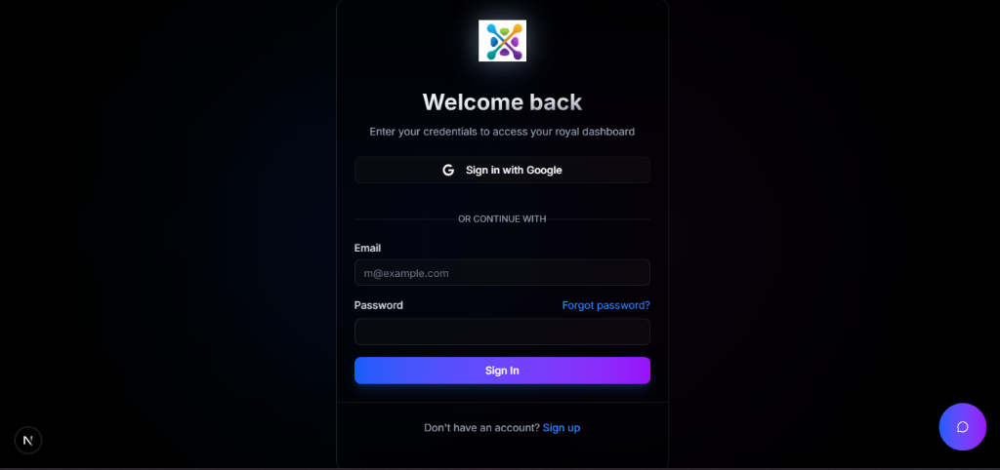
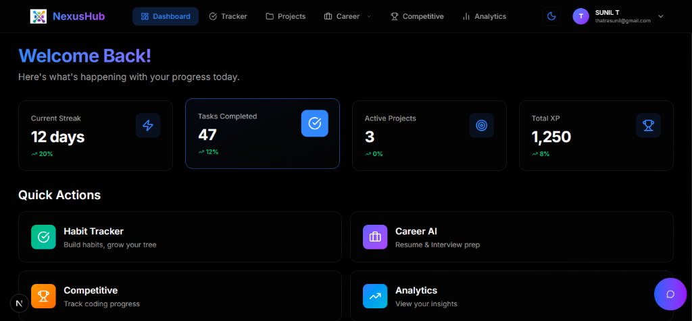
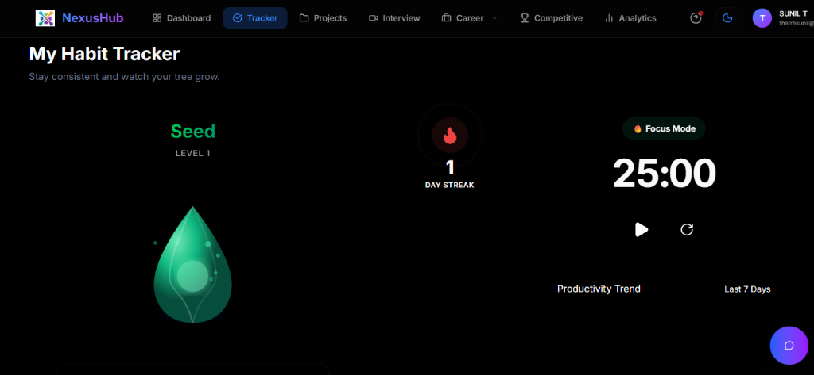
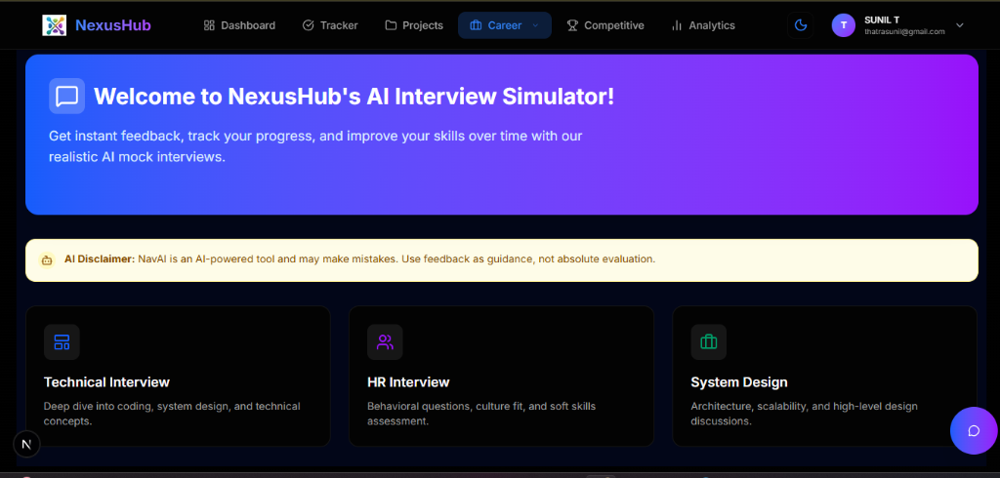
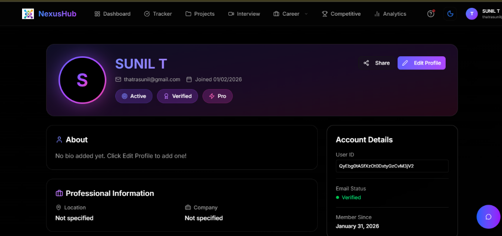

# 🟣 NexusHub 🚀


### Build Skills. Collaborate. Get Hired.

An AI-powered productivity, collaboration, and career platform that helps students and developers grow consistently, build real-world projects, and become job-ready — all in one unified workspace.

---

## 🌟 Overview

NexusHub is a full-stack SaaS platform designed to solve a common problem faced by students and early developers:

*   **learning is scattered**
*   **consistency is hard**
*   **collaboration is limited**
*   **resumes lack proof of skills**

Instead of using multiple tools for planning, coding, teamwork, and job preparation, NexusHub combines everything into one smart ecosystem.

**It connects:**
👉 **Daily Effort** → **Skill Growth** → **Team Projects** → **Career Success**

**Think of it like:**
Notion + GitHub + LeetCode + LinkedIn + Resume AI — combined into one hub.

---

## ❌ Problem Statement

Students and developers today:
❌ use separate apps for tracking, coding, resumes, and interviews
❌ struggle to stay consistent
❌ find it hard to locate serious teammates
❌ cannot showcase real skills to recruiters

**This leads to low productivity and missed opportunities.**

---

## ✅ Our Solution

NexusHub provides:
✅ **Daily productivity tracking**
✅ **Gamified streak & growth system**
✅ **Real-time collaborative project workspace**
✅ **AI-powered resume & interview tools**
✅ **Competitive coding analytics**
✅ **Smart teammate matching**

**All inside one platform.**

---

## 🧩 Core Features

### 🌱 Daily Tracker & Growth System
*   Plan daily tasks
*   Track completion
*   XP rewards
*   Streak system
*   Tree growth gamification
*   **Builds discipline through visual progress.**

### 👥 Project Workspace
*   Live code editor
*   Chat
*   Whiteboard
*   Team presence
*   File system
*   Run & save code
*   **Real-time collaboration like Google Docs for developers.**

### 🤝 Smart Help Matchmaking (Innovation)
*   Request help when stuck
*   AI matches best online teammate
*   Instant notification
*   Join coding room
*   **“Uber for coding help”**

### 💼 Career AI Tools
*   Resume Builder with live preview
*   ATS Resume Screener
*   AI Interview Simulator
*   Question generator
*   **Converts skills into job-ready profiles.**

### 📊 Competitive & Analytics
*   Track coding problems solved
*   Weekly progress charts
*   Productivity heatmap
*   Growth insights
*   **Makes improvement measurable.**

### 🧠 AI Smart Features
*   Skill Gap Detection
*   AI Code Reviewer
*   Resume Optimization
*   Interview Feedback
*   **Personalized career guidance.**

---

## 🔄 User Flow

1.  **1️⃣ Sign up**
2.  **2️⃣ Plan daily tasks**
3.  **3️⃣ Complete work → earn XP → tree grows**
4.  **4️⃣ Join projects & collaborate**
5.  **5️⃣ Get help instantly when stuck**
6.  **6️⃣ Generate resume**
7.  **7️⃣ Practice interviews**
8.  **8️⃣ Track progress with analytics**
9.  **9️⃣ Share portfolio with recruiters**



---

## 🏗️ Architecture



### Frontend
*   React / Next.js
*   TailwindCSS
*   Responsive UI
*   Recharts for analytics

### Backend
*   Node.js / Express (or Supabase/Firebase)
*   REST APIs
*   Authentication & role-based access

### Database
*   Users
*   Tasks
*   Logs
*   Projects
*   Members
*   Help requests
*   Resume data

### AI Services
*   OpenAI / Gemini APIs
*   Resume analysis
*   Interview simulation
*   Code review

### Deployment
*   Vercel
*   GitHub

---

## 📂 Folder Structure

```
src/
 ├── components/
 ├── pages/
 ├── modules/
 │    ├── tracker/
 │    ├── projects/
 │    ├── career/
 │    ├── analytics/
 ├── services/
 ├── hooks/
 ├── utils/
```

---

## 🚀 Getting Started

1.  **Clone**
    ```bash
    git clone https://github.com/yourusername/nexushub.git
    cd nexushub
    ```

2.  **Install**
    ```bash
    npm install
    ```

3.  **Run**
    ```bash
    npm run dev
    ```

---

## 🎯 Target Users

*   Computer Science students
*   Hackathon teams
*   Competitive programmers
*   Early-career developers

---

## 🏆 Key Innovation

Unlike tools that focus on only one part of growth, NexusHub integrates:
✔ **Productivity**
✔ **Collaboration**
✔ **Career Preparation**
✔ **AI Intelligence**

**This creates a complete growth ecosystem, not just another tracker app.**

---

### Landing Page


### Login / Signup


### Dashboard


### Tracker


### Interview Simulator


### Profile

---

## 🌍 Future Scope

*   Mentor matching
*   Auto team builder
*   API sync with LeetCode/GFG
*   AI project generator
*   Public portfolio pages

---

---

## 💡 One Line Pitch

**NexusHub transforms daily learning into measurable growth, teamwork into real projects, and skills into career success.**

---

